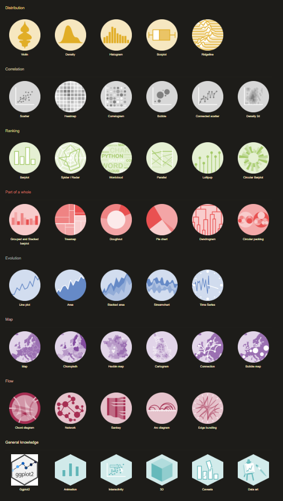

# R-Basics


This repository was made during the R certification of Harvard.

## Objects

| Syntax        | Description                                        |
|:------------- |:-------------------------------------------------- |
| ``a<-1``      | assignment "a=1"                                   |
| ``prtint(a)`` | print object **a**                                 |
| ``ls()``      | print names of the objects saved in your workplace |

## Functions
``args(function)`` Show required args of a function:


``?function``/ ``help(function)`` Show help for the given function

| Functions                      | Description                                                       |
|:------------------------------ |:----------------------------------------------------------------- |
| ``exp()``                      | exponential                                                       |
| ``log()``                      | logarithm                                                         |
| ``sqrt()``                     | square root                                                       |
| ``class()``                    | print type                                                        |
| ``str()``                      | show structure of an object                                       |
| ``names()``                    | show column names                                                 |
| ``dataset$column``             | print the column of the given dataset and column                  |
| ``length()``                   | return length of objects                                          |
| ``seq(1,5)`` or ``1:5``        | generate integer from 1 to 5                                      |
| ``identical``                  | check if to column are the same                                   |
| ``table()``                    | display the number of unique item and how many time they occurred |
| ``names(temperature) <- city`` | set the "names" attribute of a vector (including a list)          |
| ``sum()``                      | sum                                                               |

# Sort

| function    | set           | Description                                                                                               |
| ----------- | ------------- | --------------------------------------------------------------------------------------------------------- |
| original    | 31,4,15,92,65 | original                                                                                                  |
| ``sort()``  | 4,15,31,65,92 | sorts the vector in an ascending order.                                                                   |
| ``order()`` | 2,3,1,5,4     | returns the indices of the vector in a sorted order.                                                      |
| ``rank()``  | 3,1,2,5,4     | gives the respective rank of the numbers present in the vector, the smallest number receiving the rank 1. |

for example:

``sort(c (3, 1, 2, 5, 4))`` will give ``c(1,2,3,4,5)``

``rank(c (3, 1, 2, 5, 4))`` will give ``c(3,1,2,5,4)``

``order(c (3, 1, 2, 5, 4))`` will give ``c(2,3,1,5,4).``


# Which

"**Which**" is the **equivalent** of a **condition** 'if' that **return the INDEX of the argument** that had the **condition fulfilled**.


 **i.g** Create a vector "ind" for states in the Northeast and with murder rates lower than 1.
```
ind <- low & murders$region == "Northeast"
```
 Names of states in `ind`
```
murders$state[ind]
```
# Match

"**Match**"

**i.g** Store the 3 abbreviations in a vector called `abbs` (remember that they are character vectors and need quotes)
```
abbs <- c("PA","RI","SC")
```
 Match the abbs to the murders$abb and store in ind``
```
ind <- match( abbs, murders$abb )
```
Print state names from ind
```
murders$state[ind]
```
# %in%
 **i.g** Store the 5 abbreviations in `abbs`. (remember that they are character vectors)
```
abbs<-c("MA", "ME", "MI", "MO", "MU")
```
 Use the %in% command to check if the entries of abbs are abbreviations in the the murders data frame
```
abbs %in% murders$abb
```
# !
**i.g** Store the 5 abbreviations in abbs. (remember that they are character vectors)
```
abbs <- c("MA", "ME", "MI", "MO", "MU")
```
use the `which` command and `!` operator to find out which index abbreviations are not actually part of the dataset and store in `ind`
```
ind <- which( !abbs %in% murders$abb )
```
Names of abbreviations in `ind`
```
abbs[ind]
```
# dplyr
**dplyr** is one of the **majors library** of R.The features of this library that we will study here are : **Mutate, Select, Filter and Pipe.**

**i.g** Loading the dplyr library:

```
library(dplyr)
```

## Mutate
Redefine murders so that it includes a column named rate with the per 100,000 murder rates
```
mutate(murders, rate= murders$total/ murders$pop * 100000)
```
______________
Redefine murders to include a column named rank
with the ranks of rate from highest to lowest
```
murders<- mutate(murders, rank(-rate))
```
## Select
 Use select to only show state names and abbreviations from murders
```
select(murders,state, abb)
```
## Filter

 Add the necessary columns
 ```
murders <- mutate(murders, rate = total/population * 100000, rank = rank(-rate))
```
 Filter to show the top 5 states with the highest murder rates
 ```
murders<-filter(murders, rank < 5)
```
________________________

Use filter to create a new data frame no_south
```
no_south <- filter(murders, region !="South")
```
Use nrow() to calculate the number of rows
```
nrow(no_south)
```
________________________
Create a new data frame called murders_nw with only the states from the northeast and the west
```
murders_nw<- data.frame(filter(murders, region %in% c("West", "Northeast")))
```
Number of states (rows) in this category
```
nrow(murders_nw)
```
## Pipe
show the result and only include the state, rate, and rank columns, all in one line
```
filter(murders, region %in% c("West","Northeast")& rate<1 ) %>% select(state,rate,rank)
```
_________________
```
my_states <- data.frame(murders) %>% mutate(rate = (total/population)*100000,rank = rank(-rate)) %>% filter(region %in% c("West","Northeast")& rate <1) %>% select(state,rate,rank)
```

# Charts

There is a lot of different chart that can help you understand your data.
here is a (website)[https://www.r-graph-gallery.com/] that reference all the charts with example for each one.

[](https://www.r-graph-gallery.com/)

# plot
Transform population using the log10 transformation and save to object log10_population
```
log10_population <- log10(murders$population)
```
Transform total gun murders using log10 transformation and save to object log10_total_gun_murders
```
log10_total_gun_murders <- log10(murders$total)
```
Create a scatterplot with the log scale transformed population and murders
```
plot(log10_population, log10_total_gun_murders)
```
# Histogram
```
population_in_millions <- murders$population/10^6

#Create a histogram of this variable
hist(population_in_millions)
```
# Boxplot
Create a boxplot of state populations by region for the murders dataset
```
boxplot(population~region ,data=murders)
```
# Condition

The classical "if(){}else()" can be used in R but more efficient way is to use the function **ifelse**.

**i.e** ifelse( **condition , outpout_if_condition_fulfilled , else**)

**i.g** Assign the planet size when the planet size is smaller than 8000000, else assign satellite size :

```
new_names<-ifelse(nchar(space$planet_size) < 8000000,space$planet_size ,space$satellite_size)
```

# Functions
**i.g** Create function called `nbr_planet`:

```
nbr_planet <- function(n){
  y<-lenght()
}
sum_n(space$planet)
```

# Loop

# Apply family
